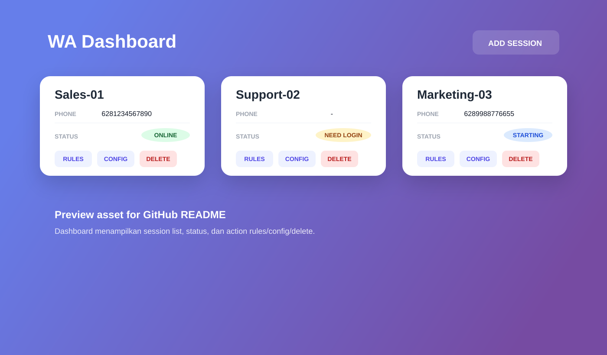
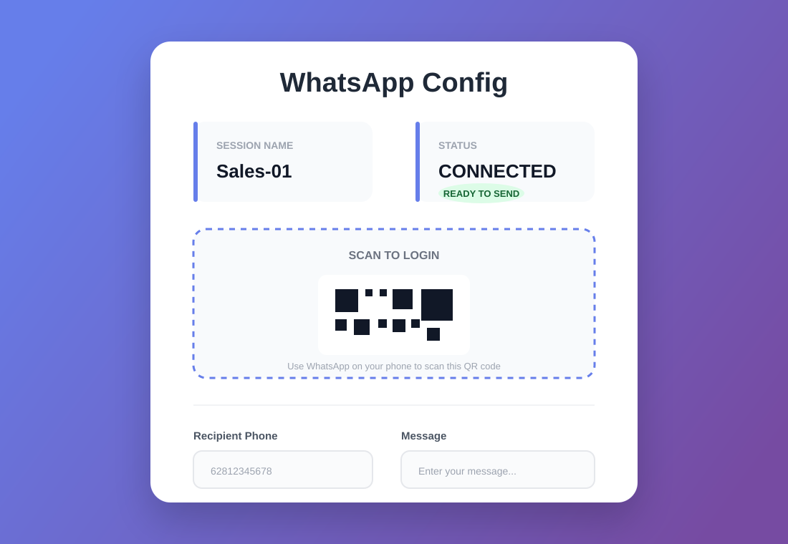

# WhatsApp Chatbot Server with Baileys

Server Chatbot WhatsApp berbasis Node.js, Express, Socket.IO, SQLite, dan Baileys untuk:

- multi-session WhatsApp
- login QR dan reconnect session
- dashboard web untuk monitoring session
- kirim pesan text, bulk message, dan image
- rule-based chatbot per session
- integrasi business flow chatbot

## Preview

### Dashboard



### Session Config



## Fitur

- Multi-session WhatsApp dengan auth tersimpan di folder `sessions/`
- Realtime QR login dan status koneksi via Socket.IO
- Dashboard web untuk create, monitor, config, dan delete session
- Endpoint kirim pesan tunggal, bulk safe, dan image
- Chatbot rules per session dengan operasi create, read, update, delete
- Penyimpanan lokal memakai SQLite di `database/wa.db`
- Auto-load session aktif saat server restart

## Stack

- Node.js
- Express
- Socket.IO
- SQLite + `sqlite3`
- `@whiskeysockets/baileys`

## Struktur Project

```text
.
|- database/              Database SQLite lokal
|- logs/                  Log runtime
|- public/                Dashboard web statis
|  |- index.html          Halaman dashboard session
|  |- config.html         Halaman config dan kirim pesan
|  `- js/                 Logic frontend dashboard/config
|- sessions/              Auth state WhatsApp per session
|- uploads/               File upload lokal
|- chatbot.js             Logic chatbot
|- db.js                  Inisialisasi tabel dan migrasi sederhana
|- qr-store.js            Penyimpanan QR sementara
|- server.js              Entry point API + Socket.IO + dashboard
|- wa-manager.js          Lifecycle session WhatsApp
`- wa-worker.js           Worker pengiriman pesan
```

## Menjalankan Project

### 1. Install dependency

```bash
npm install
```

### 2. Start server

```bash
node server.js
```

### 3. Buka dashboard

```text
http://localhost:3030
```

## Alur Penggunaan

1. Buka dashboard di `/`
2. Tambahkan session baru
3. Buka halaman config session
4. Scan QR WhatsApp sampai status menjadi `CONNECTED`
5. Gunakan endpoint API atau form dashboard untuk mengirim pesan
6. Tambahkan chatbot rules bila ingin auto-reply

## API Docs

Base URL default:

```text
http://localhost:3030
```

Semua body request menggunakan `Content-Type: application/json`, kecuali jika Anda menambahkan lapisan upload sendiri di luar implementasi saat ini.

### 1. Create Session

`POST /api/wa/create`

Request:

```json
{
  "sessionName": "Sales-01"
}
```

Response:

```json
{
  "ok": true,
  "uid": "2fd8b8d2f3c61a11",
  "sessionName": "Sales-01"
}
```

### 2. List Sessions

`GET /api/wa/list`

Response:

```json
[
  {
    "uid": "2fd8b8d2f3c61a11",
    "session_name": "Sales-01",
    "phone": "62812xxxxxxx",
    "status": "CONNECTED",
    "last_seen": null
  }
]
```

### 3. Get QR / Status Session

`GET /api/wa/qr/:sessionId`

Contoh:

```bash
curl http://localhost:3030/api/wa/qr/2fd8b8d2f3c61a11
```

### 4. Get Session Detail

`POST /api/wa/session`

Request:

```json
{
  "sessionId": "2fd8b8d2f3c61a11"
}
```

Catatan:

- Jika `sessionId` kosong atau bernilai `default`, server akan mencari `Default-Session`

### 5. Send Message

`POST /api/wa/send`

Request:

```json
{
  "sessionId": "2fd8b8d2f3c61a11",
  "to": "6281234567890",
  "message": "Halo dari API"
}
```

Response:

```json
{
  "ok": true,
  "to": "6281234567890@s.whatsapp.net",
  "sessionId": "2fd8b8d2f3c61a11",
  "message": "Halo dari API"
}
```

Catatan:

- Nomor akan dibersihkan menjadi format internasional lalu diubah ke JID WhatsApp
- Jika `to` berisi `@g.us`, pesan akan diperlakukan sebagai group message

### 6. Send Bulk Safe

`POST /api/wa/send-bulk-safe`

Request:

```json
{
  "sessionId": "2fd8b8d2f3c61a11",
  "messages": [
    {
      "number": "6281234567890",
      "name": "Budi",
      "message": "Halo {name}, follow up pada {time}"
    },
    {
      "number": "6289876543210",
      "name": "Siti",
      "message": "Halo {name}, follow up pada {time}"
    }
  ]
}
```

Response awal:

```json
{
  "ok": true,
  "message": "Bulk sending started safely",
  "total": 2
}
```

Catatan:

- Pengiriman dilakukan async setelah response dikirim
- Implementasi saat ini membatasi hingga 50 pesan per batch
- Ada random delay 5-15 detik antar pesan

### 7. Send Image

`POST /api/wa/send-image`

Request:

```json
{
  "sessionId": "2fd8b8d2f3c61a11",
  "wa_wali": "6281234567890",
  "wa": "6281234567890",
  "filename": "bukti-bayar.png",
  "image": "data:image/png;base64,iVBORw0KGgoAAA..."
}
```

Response:

```json
{
  "ok": true
}
```

Catatan:

- Field `image` harus berupa data URL base64 PNG
- Caption yang dikirim saat ini adalah `Bukti Pembayaran`

### 8. Reconnect Session

`POST /api/wa/reconnect/:sessionId`

Response:

```json
{
  "ok": true
}
```

### 9. Delete Session

`DELETE /api/wa/delete/:sessionId`

Response:

```json
{
  "ok": true
}
```

Catatan:

- Endpoint ini menghapus data session dari database
- Folder auth session di `sessions/<sessionId>` juga akan dihapus

### 10. Toggle Chatbot

`POST /api/wa/toggle-chatbot/:sessionId`

Request:

```json
{
  "enable": true
}
```

Response:

```json
{
  "ok": true,
  "enable": true
}
```

### 11. Chatbot Rules CRUD

#### List Rules

`GET /api/chatbot/rules/:sessionId`

#### Create Rule

`POST /api/chatbot/rules/:sessionId`

Request:

```json
{
  "trigger_word": "halo",
  "response": "Halo juga, ada yang bisa saya bantu?",
  "action_type": "reply",
  "action_param": null
}
```

Response:

```json
{
  "ok": true,
  "id": 1,
  "session_id": "2fd8b8d2f3c61a11",
  "trigger_word": "halo",
  "response": "Halo juga, ada yang bisa saya bantu?",
  "action_type": "reply",
  "action_param": null
}
```

#### Update Rule

`PUT /api/chatbot/rules/:ruleId`

#### Delete Rule

`DELETE /api/chatbot/rules/:ruleId`

### 12. Legacy Rule Setter

`POST /api/wa/set-chatbot-rules/:sessionId`

Request:

```json
{
  "rules": {
    "halo": "Halo juga",
    "jam kerja": "Kami buka Senin-Jumat"
  }
}
```

Endpoint ini masih ada di server, tetapi manajemen rule utama project ini memakai tabel `session_chatbot_rules` dan endpoint CRUD di atas.

## Socket.IO Events

Server memakai event realtime berikut untuk dashboard:

- `join-session` untuk join room session
- `config` untuk memicu pemuatan status dan start session
- `qr` untuk menerima QR login
- `status` untuk update status sementara
- `ready` saat session berhasil terkoneksi
- `disconnected` saat session terputus

## Penyimpanan Lokal

Runtime data disimpan di:

- `database/wa.db`
- `sessions/`
- `logs/`
- `uploads/`

Folder dan file runtime tersebut sudah diabaikan oleh Git agar repo tetap ringan dan aman saat di-push ke GitHub.

## Dokumentasi Tambahan

- [CHATBOT_SERVICES.md](CHATBOT_SERVICES.md) untuk flow business chatbot

## GitHub Notes

File yang aman untuk di-commit:

- source code
- file dashboard di `public/`
- dokumentasi project

File yang sebaiknya tidak di-upload:

- `node_modules/`
- `database/*.db`
- `sessions/`
- `logs/`
- `uploads/`
